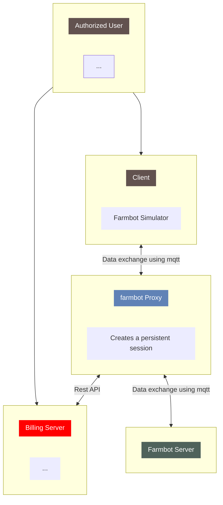

# farmbotProxy

An mqtt proxy server for farmbot.

## Table of Contents
- [Flow Diagram](#flow-diagram)
- [Usage](#usage)
- [Installation](#installation)

## Flow Diagram


This proxy server creates a persistent connection to the farmbot server so that there is no need for reconnection every time a client connects. It also hands the publishing of certain data such as logs, etc. This behaviour is especially important when developing applications that require an mqtt connection to the farmbot server/broker. If bugs occur, for instance, the application may be restarted several times during debugging and this may result in it exceeding the rate limit and getting locked out for sometime, thus wasting a lot of time. This proxy broker solves this problem.

Another further use is in implementing billing for farmbot simulator. Refer to the diagram above.

**[⬆ back home](#table-of-contents)**

## Usage
```
Usage:
  farmbotproxy [command]

Available Commands:
  help        Help about any command
  init        Create service and config files
  restart     Restart farmbotproxy service
  run         Run farmbotproxy
  start       Start farmbotproxy service
  stop        Stop farmbotproxy service

Flags:
  -h, --help   help for farmbotproxy
  -p, --prod   Run in production
```

This program reads settings from `/etc/farmbotproxy/*`. So you need to create these first. This will require sudo But it will download packages in `/root/go/...` which will clatter your disc. 
```bash
sudo go run . init
```

The workaround is to first build it, then run the init command:
```bash
make build
cd builds
sudo ./farmbotproxy init
```

To initialize production settings use -p
```bash
sudo ./farmbotproxy init -p
```
There is only one settings file in `/etc/farmbotsimulator/` but different services for dev and production.

To run the program:
```
go run . run
```

To create the .deb files
```
make debs
```

You can also start the service. But we do not recommed that you do this in development. If you desire to do this, you can refer to [Installation](#Installation) below.

**[⬆ back home](#table-of-contents)**
## Installation

Download the relevant file for your system from [releases](https://github.com/FarmbotSimulator/farmbotProxy/releases/tag/v1.0)

```
curl --silent "https://api.github.com/repos/FarmbotSimulator/farmbotProxy/releases/latest"|   grep "browser_download_url.*amd64.deb" | head -n 1 | cut -d : -f 2,3 | tr -d \"  | xargs wget -O tmp.deb && sudo dpkg -i tmp.deb
```
If all things go well you should have the service running:

```bash
sudo systemctl status farmbotproxy
```

**[⬆ back home](#table-of-contents)**

## Todo
- [ ] Reading version from config when packaging

## References
- [Creating .deb](https://www.internalpointers.com/post/build-binary-deb-package-practical-guide)